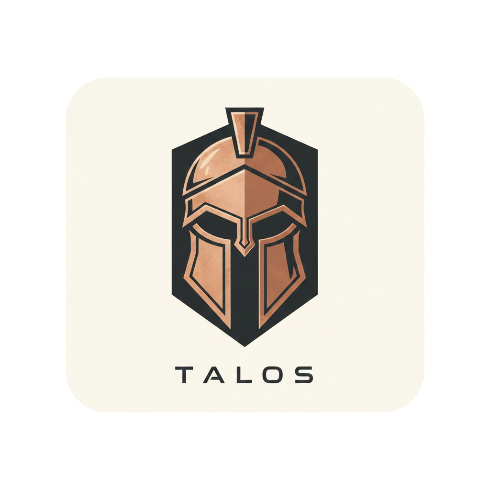

<div align="center">



# 🛡️ TALOS INFRASTRUCTURE

### Immutable SRE Infrastructure


<br/>

**TALOS** est une infrastructure **Self-Hosted**, **Sécurisée** et **Automatisée**, conçue selon les standards SRE les plus stricts ("Security First", Idempotence, GitOps) pour protéger vos services critiques.

[Philosophie](#-philosophie) • [Documentation](#-le-codex-documentation) • [Démarrage Rapide](#-démarrage-rapide-dev) • [Structure](#-structure-du-projet)

</div>

---

## 🏗️ PHILOSOPHIE

Ce projet n'est pas "juste un serveur". C'est une plateforme d'ingénierie qui respecte les standards **Enterprise / SRE**.

| Pilier | Description Technique |
| :--- | :--- |
| **🔒 Security First** | Port SSH `8888`, Auth Key-Only, **CrowdSec IPS**, Socket Proxy, Root disable. |
| **👁️ Observabilité** | Stack **LGT** (Loki-Grafana-Tempo) pour centraliser logs & métriques sans SSH. |
| **🧘 Idempotence** | Tout est code (IaC). Reset total et reconstruction en **< 30 min**. |
| **🤖 GitOps** | Modifications via Git uniquement. Déploiement piloté par **Ansible**. |

---

## 📚 LE CODEX (DOCUMENTATION)

La documentation est la source de vérité absolue.

> [!IMPORTANT]
> Ne lancez aucune commande admin sans avoir consulté les procédures correspondantes.

<div align="center">

| 🏛️ ARCHITECTURE | 📅 MIGRATION | ⚡ CHEATSHEET | 🕵️‍♂️ AUDIT |
| :---: | :---: | :---: | :---: |
| [Accéder à l'Architecture](docs/ARCHITECTURE.md) | [Voir le Plan](docs/MIGRATION_PLAN.md) | [Commandes Vitales](docs/CHEATSHEET.md) | [Rapport de Sécurité](docs/AUDIT_REPORT.md) |
| *Network, Security, Stack* | *Zero-to-Hero Guide* | *Ops, Clean, Logs* | *Risques & Fixes* |

</div>

---

## 🛠️ PRÉ-REQUIS & INSTALLATION (CONTROL NODE)

Ce projet nécessite une machine de contrôle ("Control Node") pour piloter le déploiement.

### 1. La Stack Logicielle
| Outil | Rôle | Version Min |
| :--- | :--- | :--- |
| **Git** | Versioning du dépôt. | `2.x` |
| **Ansible** | Moteur d'automatisation (Le Pilote). | `2.10+` |
| **Vagrant** | Gestionnaire de machines virtuelles (Labo). | `2.3+` |
| **VMware Fusion/Workstation** | Hyperviseur (Moteur de VM). | `13+` |
| **VS Code** | Éditeur de code recommandé. | `Latest` |

### 2. Guide d'Installation

#### 🍏 macOS (Via Homebrew)
Le standard "Gold" pour ce projet.
```bash
# 1. Install Homebrew (si absent)
/bin/bash -c "$(curl -fsSL https://raw.githubusercontent.com/Homebrew/install/HEAD/install.sh)"

# 2. Install Tools
brew install git ansible vagrant
brew install --cask visual-studio-code vmware-fusion

# 3. Install Ansible Galaxy Roles
ansible-galaxy install -r requirements.yml
```

#### 🐧 Linux (Debian/Ubuntu)
```bash
sudo apt update && sudo apt install -y git ansible vagrant software-properties-common wget
ansible-galaxy install -r requirements.yml
```

---

## ⚡ DÉMARRAGE RAPIDE (DEV)

### 1. Initialiser l'environnement
```bash
git clone git@github.com:user/talos.git
cd talos
vagrant up
```

### 2. 🐣 Bootstrap (Day 0)
C'est le **seul** moment où l'on surcharge l'inventaire. Le serveur est en port 22/vagrant, mais l'inventaire vise déjà 8888/sentinel.
On force les paramètres de connexion pour ce premier run :

```bash
# Surcharge pour le premier lancement uniquement
ansible-playbook playbooks/bootstrap.yml --limit dev \
  -e "ansible_port=22" \
  -e "ansible_user=vagrant" \
  -e "ansible_ssh_private_key_file=.vagrant/machines/default/vmware_desktop/private_key"
```

### 3. 🚀 Déployer le Socle (Day 1+)
Une fois le bootstrap terminé, l'inventaire devient **vrai**. On peut lancer les playbooks normalement.

```bash
# Installer Docker
ansible-playbook playbooks/install_docker.yml --limit dev
```

### 3. Accès SSH (Post-Provisioning)
```bash
# Port 8888, Utilisateur 'sentinel'
ssh -p 8888 sentinel@192.168.x.x
```

---

## 📂 STRUCTURE DU PROJET

```text
talos/
├── bootstrap/          # 🐣 Init (Inventory Day 0)
├── docs/               # 📘 Le Codex (Source de Vérité)
├── group_vars/         # 🔐 Variables globales (Secrets chiffrés) (A venir)
├── inventory.yml       # 🌍 Inventaire (Prod/Dev - Day 1+)
├── playbooks/          # 🚀 Playbooks (Bootstrap, Docker, Apps)
├── roles/              # 🧱 Rôles Ansible (Profils)
├── requirements.yml    # 📦 Dépendances Galaxy
├── ansible.cfg         # ⚙️ Config Ansible
└── Vagrantfile         # 🛠️ Lab local
```

---

<div align="center">
  <b>Mainteneur :</b> ReDxOps • <b>Licence :</b> MIT
</div>