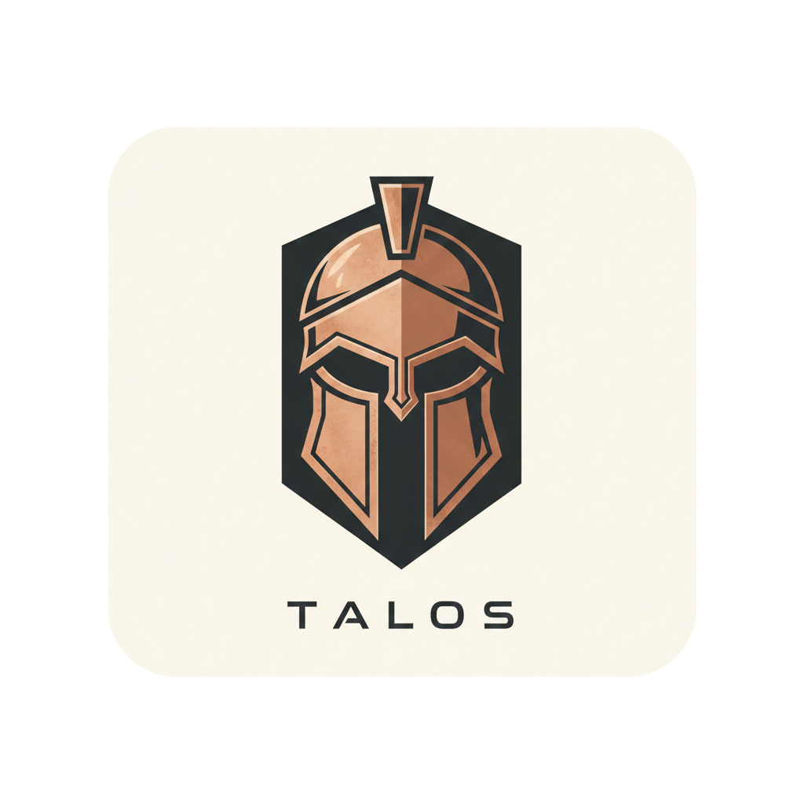
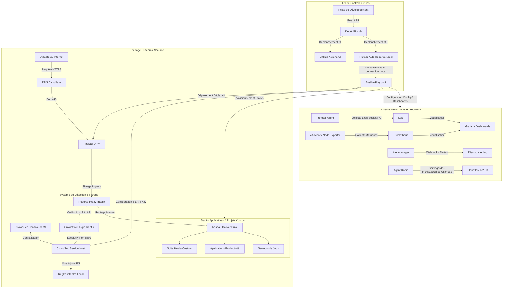

<div align="center">



# TALOS INFRASTRUCTURE

### Immutable SRE Infrastructure


<br/>
<br/>

**TALOS** est un framework d'Infrastructure as Code (IaC) et d'automatisation GitOps conçu pour le provisionnement, le hardening et la maintenance d'un serveur dédié physique Debian 12 hébergé chez OVHcloud. Il permet de reconstruire et sécuriser un serveur de production en moins de 30 minutes, selon une approche immuable et déclarative, tout en proposant un cycle de déploiement continu sécurisé via un runner auto-hébergé local.

</div>

---

## 1. Architecture Globale du Système

Le schéma suivant modélise le flux d'automatisation GitOps, le routage du trafic réseau à travers les couches de sécurité et l'intégration des services transverses (sauvegarde et observabilité).


```mermaid
flowchart TB
    subgraph GitOps ["Flux de Contrôle GitOps"]
        Dev[Poste de Développement] -->|Push / PR| GH[Dépôt GitHub]
        GH -->|Déclenchement CI| GHA[GitHub Actions CI]
        GH -->|Déclenchement CD| Runner[Runner Auto-Hébergé Local]
        Runner -->|Exécution locale --connection=local| Ansible[Ansible Playbook]
    end

    subgraph Reseau ["Routage Réseau & Sécurité"]
        Internet[Utilisateur / Internet] -->|Requête HTTPS| CF[DNS Cloudflare]
        CF -->|Port 443| UFW[Firewall UFW]
        UFW -->|Filtrage Ingress| Traefik[Reverse Proxy Traefik]
        
        subgraph Securite ["Système de Détection & Filtrage"]
            CS_Console[CrowdSec Console SaaS] <-->|Centralisation| CS_Host[CrowdSec Service Host]
            CS_Host -->|Mise à jour IPS| Iptables[Règles iptables Local]
            Traefik -->|Verification IP / LAPI| CS_Plugin[CrowdSec Plugin Traefik]
            CS_Plugin <-->|Local API Port 8080| CS_Host
        end
        
        Traefik -->|Routage Interne| AppNetwork[Réseau Docker Privé]
        subgraph Applications ["Stacks Applicatives & Projets Custom"]
            AppNetwork --> Hestia[Suite Hestia Custom]
            AppNetwork --> ProdApps[Applications Productivité]
            AppNetwork --> Gaming[Serveurs de Jeux]
        end
    end

    subgraph Services ["Observabilité & Disaster Recovery"]
        Promtail[Promtail Agent] -->|Collecte Logs Socket RO| Loki[Loki]
        Cadvisor[cAdvisor / Node Exporter] -->|Collecte Métriques| Prom[Prometheus]
        Loki & Prom -->|Visualisation| Grafana[Grafana Dashboards]
        Alertmgr[Alertmanager] -->|Webhooks Alertes| Discord[Discord Alerting]
        
        Kopia[Agent Kopia] -->|Sauvegardes Incrémentielles Chiffrées| R2[Cloudflare R2 S3]
    end

    Ansible -->|Déploiement Déclaratif| UFW
    Ansible -->|Configuration & LAPI Key| CS_Host
    Ansible -->|Provisionnement Stacks| Applications
    Ansible -->|Configuration Config & Dashboards| Services
```

---

## 2. Cycle de Vie des Stacks et Centralisation

Afin de garantir l'immuabilité et de prévenir le drift d'infrastructure sur le serveur dédié, l'intégralité du cycle de vie des conteneurs et des services est pilotée de manière centralisée.

### Gestion d'État Déclarative
Le fichier `playbooks/group_vars/all/stacks.yml` centralise l'état cible souhaité pour chaque stack applicative. Ansible interprète cette configuration pour appliquer l'état requis via le module `community.docker.docker_compose_v2` :
* **`present`** : La stack est déployée, démarrée et supervisée.
* **`stopped`** : La stack est déployée sur le host mais les conteneurs sont arrêtés, permettant de libérer instantanément la mémoire vive et le processeur (idéal pour les serveurs de jeux).
* **`absent`** : Les conteneurs et configurations associées sont supprimés du host, tout en conservant les volumes de données persistants.

### Gestion des Dépendances et RenovateBot
Afin d'éviter l'obsolescence et de sécuriser la chaîne logistique logicielle, le fichier `playbooks/group_vars/all/img_and_versions.yml` centralise l'ensemble des images Docker et de leurs tags respectifs.
Ce fichier utilise la syntaxe standardisée `# renovate: datasource=docker` permettant à RenovateBot d'analyser le dépôt en continu, de détecter les nouvelles versions et d'ouvrir des pull requests de mise à jour de manière automatisée.

---

## 3. Sécurité du Socle et Defense in Depth

La politique de sécurité du serveur dédié OVHcloud est articulée autour de plusieurs couches restrictives, visant à minimiser la surface d'attaque.

### Initialisation Day-0 (Bootstrap)
Lors du provisionnement initial d'une instance Debian 12 brute, le playbook `playbooks/00_bootstrap.yml` est exécuté une seule fois en tant que `root` sur le port par défaut SSH 22. Il réalise les tâches d'initialisation suivantes :
* Création de l'utilisateur d'exploitation `sentinel` et injection de sa clé publique SSH autorisée (algorithme Ed25519).
* Suppression ou désactivation des utilisateurs par défaut afin de clore les accès non maîtrisés.
* Provisionnement du répertoire distant Ansible et déploiement initial de l'agent de livraison CI/CD.

### Hardening SSH et Système
* **SSH** : Migration du service SSH sur le port non standard `8888`. Désactivation stricte de l'authentification par mot de passe (clé SSH uniquement) et désactivation totale du login de l'utilisateur `root`.
* **Kernel Hardening** : Paramétrage de variables sysctl visant à désactiver les redirections ICMP, à activer la protection contre le spoofing IP (Reverse Path Filtering) et à ignorer les requêtes de routage source.
* **NTP** : Synchronisation temporelle stricte via `systemd-timesyncd`, indispensable à la cohérence des logs d'observabilité, à la validité des décisions CrowdSec et à l'authentification multi-facteurs (TOTP).

### Firewall UFW et IPS CrowdSec
Le pare-feu UFW applique une politique par défaut fermée en entrée. Seuls les ports nécessaires sont ouverts (HTTP/HTTPS pour Traefik, le port P2P de Tailscale et les ports spécifiques aux serveurs de jeux déclarés).

CrowdSec agit comme un IPS collaboratif :
1. **Host-Level Protection** : CrowdSec surveille nativement `/var/log/auth.log` et `/var/log/syslog` sur le système hôte. Les comportements suspects entraînent un bannissement d'IP via le bouncer `crowdsec-firewall-bouncer-iptables` qui interagit directement avec les règles de filtrage réseau.
2. **Reverse Proxy Integration** : Traefik intègre le plugin `maxlerebourg/crowdsec-bouncer-traefik-plugin` v1.3.5. Lors d'une requête HTTP/HTTPS, Traefik interroge l'API locale CrowdSec (LAPI) tournant sur l'hôte (accessible via `host.docker.internal:8080`). Si l'IP cliente est signalée, la connexion est immédiatement coupée au niveau de la couche applicative.
3. **CrowdSec Console** : L'instance locale est enrôlée sur la console SaaS de CrowdSec, offrant une centralisation et une visualisation globale des alertes et des décisions appliquées sur l'infrastructure OVHcloud.

### Sécurisation de l'Environnement Docker
* **Privilèges limités** : Les conteneurs applicatifs sont configurés avec la directive `security_opt: ["no-new-privileges:true"]` pour bloquer les tentatives d'élévation de privilèges au sein du noyau.
* **Docker Socket Isolation** : La socket Docker (`/var/run/docker.sock`) n'est jamais exposée directement aux applications web externes. Seul Traefik y accède en lecture seule pour la détection dynamique des routes.
* **Gestion d'espace disque** : Configuration centralisée du démon Docker pour forcer l'usage du driver de logs `json-file` compressé, limité à 5 fichiers de 10 Mo par conteneur, évitant ainsi toute saturation de l'espace disque en cas de boucle d'erreurs.

---

## 4. Pipeline CI/CD et Modèle GitOps

L'infrastructure Talos est gérée selon un modèle GitOps strict. Toute modification de configuration doit transiter par le dépôt de code et être validée de manière automatisée.

### Validation Continue (GitHub Actions CI)
Le workflow `ci.yml` s'exécute sur chaque pull request ou push sur la branche principale :
* **Détection de secrets** : Scan du dépôt via `GitLeaks` pour s'assurer qu'aucun mot de passe ou clé n'est commité en clair.
* **Linting Ansible** : Analyse des fichiers par `ansible-lint` configuré sous le profil strict `production`.
* **Vérification IaC** : Analyse de conformité et de sécurité du code Ansible et des fichiers YAML via l'outil `Checkov`.
* **Vérification de Syntaxe** : Exécution d'un `ansible-playbook --syntax-check` sur les fichiers `site.yml` et `playbooks/00_bootstrap.yml` avec injection dynamique de structures de secrets factices pour valider l'intégrité du code.
* **Rapport automatique** : Génération d'un tableau récapitulatif synthétisant le statut de chaque vérification directement intégré dans le résumé d'exécution de GitHub Actions.

### Déploiement Continu Décentralisé (GitHub Actions CD)
Le déploiement continu s'effectue sans exposer les accès administrateurs ou les clés SSH du serveur dédié en dehors de son réseau :
* Un runner GitHub Actions auto-hébergé (`self-hosted`) est installé localement sur le serveur de production.
* Lors d'un commit sur `main`, le runner extrait le dépôt et exécute Ansible localement via le paramètre `--connection=local`.
* La clé d'authentification du coffre-fort de production est lue localement sur le disque du runner (`/home/github-runner/.vault_pass_prod`), garantissant qu'aucun secret de production ne réside ou ne transite par les serveurs SaaS de GitHub.

### Gouvernance de Maintenance Day-2 (Cron et Reboot Orchestrés)
Le système gère ses opérations de maintenance récurrentes de façon autonome :
1. **Maintenance Hebdomadaire** : Un workflow planifié (`maintenance.yml`) s'exécute chaque dimanche à 5h00. Il lance les mises à jour de paquets de l'OS (`apt dist-upgrade`), nettoie l'espace Docker (`docker system prune`), met à jour les collections du Hub CrowdSec et lance la maintenance complète de la base de sauvegarde Kopia.
2. **Reboot Sécurisé et Asynchrone** : Lorsque la maintenance nécessite un redémarrage (détection du fichier `/var/run/reboot-required`), le workflow `reboot_server.yml` initie la routine suivante :
    * Envoi d'une notification Discord via webhook pour informer les utilisateurs.
    * Arrêt ordonné de tous les conteneurs Docker via le démon de l'hôte afin d'éviter la corruption de données applicatives.
    * Lancement de la commande `shutdown -r +1` : le redémarrage est différé d'une minute, permettant à la tâche de la CI/CD de se clore proprement avec un code de retour valide avant que la connectivité ne soit coupée.
    * Un job parallèle s'exécute sur les serveurs cloud de GitHub Actions pour temporiser pendant 5 minutes, puis sollicite à nouveau le runner local pour valider le démarrage et la santé (statut `healthy`) de l'intégralité des conteneurs du serveur.
    * Envoi d'un rapport de succès final sur Discord.

---

## 5. Disaster Recovery et Sauvegardes

Le plan de continuité d'activité repose sur l'outil de sauvegarde Kopia, configuré via le rôle externe `redxops.kopia`.

### Architecture de Stockage et Rétention
Les sauvegardes sont compressées avec l'algorithme `zstd`, chiffrées de bout en bout par l'agent local Kopia, et envoyées vers un compartiment de stockage objet Cloudflare R2 via un protocole compatible S3.
La politique de rétention conserve :
* 7 sauvegardes quotidiennes.
* 4 sauvegardes hebdomadaires.
* 6 sauvegardes mensuelles.

### Plan d'Exclusion et Optimisation SRE
Afin de minimiser la bande passante consommée et l'empreinte disque sur Cloudflare R2, le volume de sauvegarde exclut de manière sélective et rigoureuse les données lourdes ou volatiles :
* **Données éphémères** : Les répertoires de stockage de Prometheus et de Loki.
* **Caches et Runtimes de livraison** : Les répertoires de cache système et les dossiers d'installation du runner GitHub Actions.
* **Binaires lourds de jeux** : Les fichiers systèmes des serveurs Satisfactory et Ark (seules les sauvegardes et configurations des parties sont conservées).
* **Bases de données brutes** : Les dossiers de volumes bruts (`db_data`, `mysql_data`, `postgres_data`) sont exclus. À la place, un dump SQL chiffré est généré à chaud de manière quotidienne juste avant le déclenchement de Kopia, garantissant la cohérence transactionnelle des bases de données lors d'une restauration.

---

## 6. Observabilité et Supervision

La surveillance du serveur dédié est assurée par une stack Prometheus et Loki, gérée via Docker Compose sous le rôle `observability`.

* **Collecte de métriques** : Prometheus collecte les métriques d'utilisation des ressources système de l'hôte (via `node-exporter`) et des indicateurs de charge individuels de chaque conteneur (via `cAdvisor`).
* **Collecte de logs** : Promtail collecte les flux de logs de l'hôte et des conteneurs via un accès en lecture seule au socket Docker, puis les transmet à Loki.
* **Dashboards et Visualisation** : Grafana est configuré pour provisionner automatiquement les sources de données Prometheus et Loki, ainsi que des tableaux de bord pré-configurés pour la surveillance du système, de l'état de Docker et du trafic réseau géré par Traefik.
* **Alerte réactive** : Alertmanager centralise les alertes générées par Prometheus et route les notifications critiques vers un canal Discord dédié en fonction de seuils d'utilisation des ressources (RAM, CPU, espace disque).

---

## 7. Catalogue Applicatif et Intégrations Custom

Talos orchestre une variété d'applications réparties dans les catégories suivantes :

| Stack Applicative | Rôles Ansible Dédiés | Description |
| :--- | :--- | :--- |
| **Productivité & Collaboration** | `wikijs`, `linkwarden`, `vikunja`, `passbolt`, `affine`, `portainer` | Base de connaissances, gestion de tâches, gestionnaire de mots de passe d'équipe, gestion de conteneurs. |
| **Sites Web & CMS** | `wp-flageulcouverture`, `wp-3lbshop` | Plateformes e-commerce et vitrines sous WordPress (PHP 8.4 Apache / MySQL / Redis). |
| **Gaming Infrastructure** | `satisfactory`, `ark-server` | Serveurs de jeux persistants isolés avec ports dédiés ouverts sur UFW. |
| **Applications Custom (Hestia)** | `hestia-studio`, `hestia-loyalty`, `invoiceninja-hestia` | Solutions propriétaires développées sur mesure. |

### Focus sur la suite applicative Hestia
Les applications de la suite Hestia constituent des déploiements complexes sur mesure. Leurs rôles Ansible intègrent :
* La gestion de bases de données isolées PostgreSQL / MariaDB et de caches Redis dédiés.
* Des configurations Nginx sur mesure intégrées sous forme de conteneurs tiers au sein du réseau privé Docker.
* L'intégration avec des pipelines GitOps distants (les workflows de build et de livraison étant hébergés sur les dépôts de développement respectifs, s'interfaçant avec le orchestrateur de production Talos).

---

## 8. Structure des Fichiers du Projet

```text
talos/
├── .github/workflows/       # Workflows d'automatisation CI/CD (GitHub Actions)
├── assets/                  # Ressources statiques et logos
├── collections/             # Collections Ansible tierces installées par Galaxy
├── group_vars/              # Variables et secrets globaux
├── inventories/             # Fichiers d'inventaires par environnement
│   ├── bootstrap/           # Day-0 : Accès initiaux temporaires
│   ├── dev/                 # Environnement de développement Vagrant
│   └── prod/                # Environnement de production (serveur OVHcloud)
├── playbooks/               # Playbooks de découpage par phases opérationnelles
├── roles/                   # Rôles Ansible locaux (configuration et applications)
├── roles_external/          # Rôles Ansible externes importés par Galaxy
├── scripts/                 # Scripts utilitaires d'administration
├── Vagrantfile              # Définition de l'infrastructure de développement locale
├── ansible.cfg              # Configuration du moteur Ansible et des Vault IDs
├── requirements.yml         # Dépendances de rôles et collections externes
└── site.yml                 # Master Playbook orchestrant toutes les phases
```

---

## 9. Cheatsheet Opérationnelle

### Administration Multi-Environnements et Secrets
Les clés de déchiffrement Ansible Vault sont configurées de manière transparente dans `ansible.cfg` afin d'éviter la saisie manuelle de mots de passe.
* **Édition des secrets de développement** :
  ```bash
  ansible-vault edit inventories/dev/group_vars/all/secrets.yml --vault-id dev@.vault_pass_dev
  ```
* **Édition des secrets de production** :
  ```bash
  ansible-vault edit inventories/prod/group_vars/all/secrets.yml --vault-id prod@.vault_pass_prod
  ```

### Exécution locale du Lab de Développement
1. Démarrer la machine virtuelle Debian 12 en local via Vagrant :
   ```bash
   vagrant up
   ```
2. Initialiser le serveur de développement (Phase Day-0) :
   ```bash
   ansible-playbook playbooks/00_bootstrap.yml -i inventories/bootstrap/hosts.yml --limit talos-dev
   ```
3. Déployer l'intégralité du catalogue applicatif et de sécurité (Phase Day-1+) :
   ```bash
   ansible-playbook site.yml
   ```

### Commandes Opérationnelles de Secours en Production
* **Vérifier l'intégrité de la syntaxe des configurations** :
  ```bash
  ansible-playbook site.yml --syntax-check
  ```
* **Déployer ou mettre à jour sélectivement une stack applicative** (ex. Traefik) :
  ```bash
  ansible-playbook site.yml -i inventories/prod/hosts.yml --tags traefik
  ```
* **Administration CrowdSec (en ligne de commande sur l'hôte)** :
  * Lister les décisions de bannissement actives :
    ```bash
    cscli decisions list
    ```
  * Bannir manuellement une adresse IP malveillante pour 48 heures :
    ```bash
    cscli decisions add --ip 1.2.3.4 --duration 48h --reason "Tentatives bruteforce"
    ```
  * Révoquer un bannissement d'adresse IP :
    ```bash
    cscli decisions delete --ip 1.2.3.4
    ```
* **Nettoyage d'urgence des ressources Docker dormantes** (à utiliser en cas de saturation de disque) :
  ```bash
  docker system prune -a -f --volumes
  ```